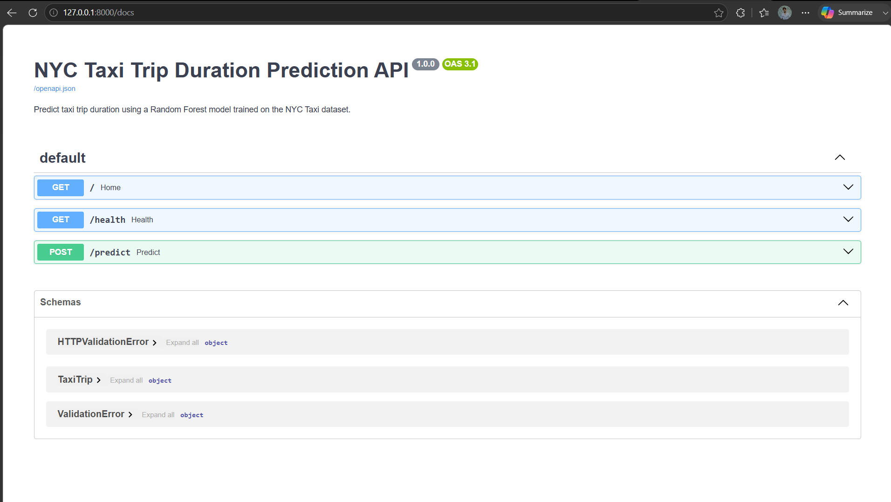
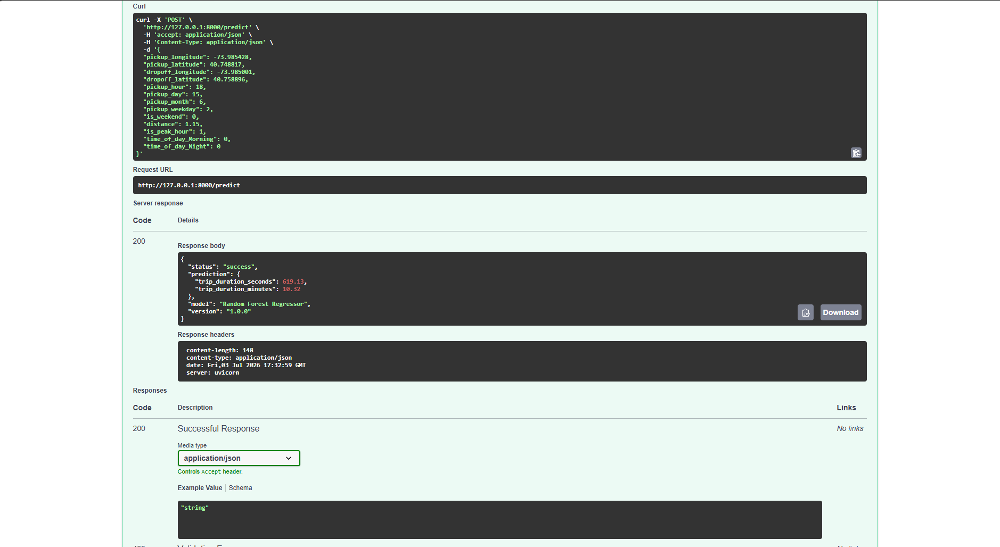
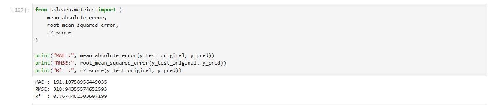
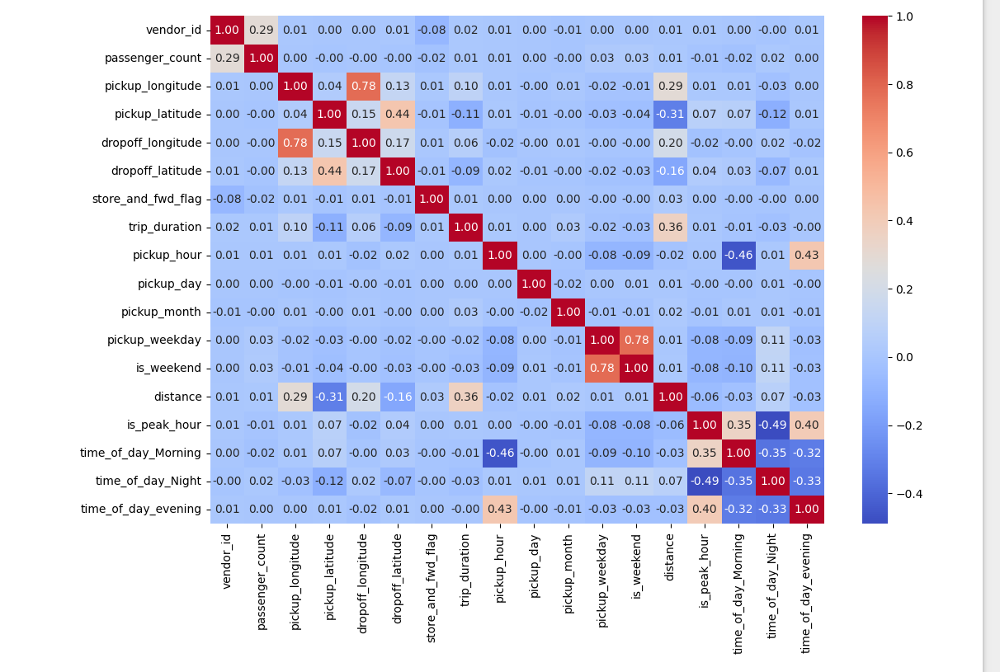
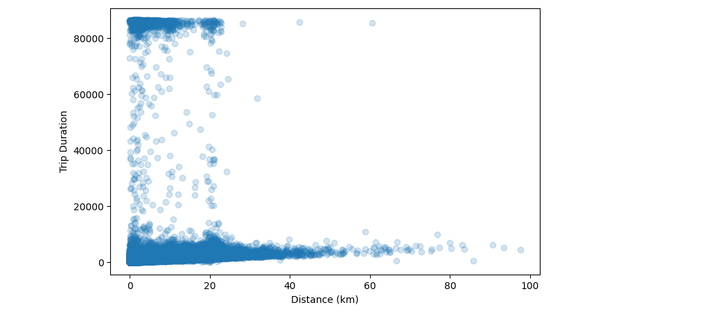

# 🚖 NYC Taxi Trip Duration Prediction


---

## 🌐 Live Demo

### 🚀 Live API

**https://nyc-taxi-trip-duration-api.onrender.com/**

### 📄 Interactive API Documentation (Swagger)

**https://nyc-taxi-trip-duration-api.onrender.com/docs**

---

# 📌 Project Overview

This project predicts the duration of New York City taxi trips using Machine Learning.

The project covers the complete Machine Learning lifecycle:

- Data Cleaning
- Exploratory Data Analysis (EDA)
- Feature Engineering
- Model Training
- Model Evaluation
- Docker Containerization
- FastAPI Deployment
- Cloud Deployment on Render

Users can interact with the deployed REST API through Swagger UI and obtain real-time trip duration predictions.

---

# 🚀 Features

- Data Cleaning
- Outlier Detection & Removal
- Feature Engineering
- Haversine Distance Calculation
- Peak Hour Detection
- Weekend Detection
- Time of Day Classification
- Log Transformation
- Random Forest Regression
- REST API using FastAPI
- Dockerized Application
- Cloud Deployment on Render

---

# 📊 Dataset

Dataset:

**NYC Taxi Trip Duration Dataset**

### Target Variable

- Trip Duration

### Features Used

- Pickup Longitude
- Pickup Latitude
- Dropoff Longitude
- Dropoff Latitude
- Pickup Hour
- Pickup Day
- Pickup Month
- Pickup Weekday
- Distance
- Peak Hour
- Weekend Indicator
- Time of Day

---

# 🛠 Data Preprocessing

Performed the following preprocessing steps:

- Removed duplicate records
- Removed missing values
- Removed invalid trips
- Removed unrealistic trip durations
- Removed long-distance outliers
- Removed extremely slow trips
- One-Hot Encoding
- Feature Scaling (where required)
- Log Transformation of Target Variable

---

# ⚙ Feature Engineering

Engineered Features

- Pickup Hour
- Pickup Day
- Pickup Month
- Pickup Weekday
- Weekend Indicator
- Peak Hour Indicator
- Time of Day
- Haversine Distance

---

# 🤖 Machine Learning Model

### Algorithm

Random Forest Regressor

### Libraries

- Pandas
- NumPy
- Scikit-learn
- Joblib
- FastAPI

---

# 📈 Model Performance

| Metric | Value |
|---------|-------|
| MAE | **191.11 sec** |
| RMSE | **318.94 sec** |
| R² Score | **0.7674** |

---

# 🚀 REST API

## Home Endpoint

```
GET /
```

Returns

```json
{
  "message":"Welcome to Taxi Trip Duration Prediction API"
}
```

---

## Prediction Endpoint

```
POST /predict
```

Example Request

```json
{
  "pickup_longitude": -73.985428,
  "pickup_latitude": 40.748817,
  "dropoff_longitude": -73.985001,
  "dropoff_latitude": 40.758896,
  "pickup_hour": 18,
  "pickup_day": 15,
  "pickup_month": 6,
  "pickup_weekday": 2,
  "is_weekend": 0,
  "distance": 1.15,
  "is_peak_hour": 1,
  "time_of_day_Morning": 0,
  "time_of_day_Night": 0
}
```

Example Response

```json
{
  "predicted_trip_duration_seconds": 619.13,
  "predicted_trip_duration_minutes": 10.32
}
```

---

# 📸 Project Screenshots

## 📁 Project Structure


---

## 🚀 Swagger Documentation



---

## 🔮 Prediction API



---

## 📈 Model Performance



---

## 🔥 Correlation Heatmap



---

## 📉 Trip Duration Distribution


---

## 🚖 Distance vs Trip Duration



---

# 📂 Project Structure

```
NYC-Taxi-Trip-Duration-Prediction
│
├── app.py
├── Dockerfile
├── .dockerignore
├── requirements.txt
├── feature_columns.pkl
├── taxi_trip_duration_model.pkl
├── README.md
├── .gitignore
│
├── notebook/
│   └── NYC_Taxi_Trip_Duration_Prediction.ipynb
│
└── screenshots/
    ├── project-structure.png
    ├── swagger-ui.png
    ├── prediction-response.png
    ├── feature-importance.png
    ├── model-performance.png
    ├── correlation-heatmap.png
    ├── trip-duration-distribution.png
    └── distance-vs-trip-duration.png
```

---

# 🛠 Tech Stack

- Python
- Pandas
- NumPy
- Matplotlib
- Seaborn
- Scikit-learn
- FastAPI
- Docker
- Joblib
- Git
- GitHub
- Render

---

# 💻 Installation

Clone the repository

```bash
git clone https://github.com/Adityasinghrajput01/NYC-Taxi-Trip-Duration-Prediction.git
```

Move inside the project

```bash
cd NYC-Taxi-Trip-Duration-Prediction
```

Install dependencies

```bash
pip install -r requirements.txt
```

Run FastAPI

```bash
uvicorn app:app --reload
```

Open

```
http://127.0.0.1:8000/docs
```

---

# 🐳 Docker

Build the Docker image

```bash
docker build -t nyc-taxi-api .
```

Run the container

```bash
docker run -p 8000:8000 nyc-taxi-api
```

---

# ☁ Deployment

The application is deployed on **Render** using **Docker**.

Live URL:

**https://nyc-taxi-trip-duration-api.onrender.com**

Swagger UI:

**https://nyc-taxi-trip-duration-api.onrender.com/docs**

---

# 🔮 Future Improvements

- XGBoost & LightGBM Models
- Hyperparameter Tuning
- Model Monitoring
- CI/CD Pipeline
- Automated Retraining
- Frontend Dashboard
- User Authentication

---

# 👨‍💻 Author

## Aditya Kumar Singh

**LinkedIn**

https://www.linkedin.com/in/aditya-kumar-singh-173911321/

**GitHub**

https://github.com/Adityasinghrajput01

---

## ⭐ If you found this project useful, please consider giving it a Star!
